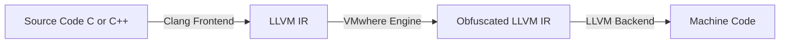
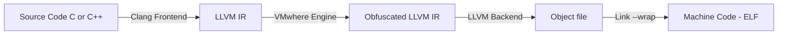

# VMwhere - Obfuscation Engine

## Introduction

### Objective:
The objective of this project is to devise a flexible obfuscation engine that allows developers to protect their IP by applying a variety of obfuscation and anti-reverse engineering techniques.

### Threat Model:
Attackers with access to compiled binary often employ a variety of tools to extract key pieces of information from the binary. Common tools include debuggers, disassemblers, decompilers, emulators etc.  We assume that the attacker has unrestricted access to the compiled binary (is able to execute it, disassemble it etc)  and does not have access to the source code.  

### Overview of Framework:
VMwhere is designed to provide protection against both forms of analysis - Static analysis and Dynamic analysis. It does so by implementing obfuscation techniques using the LLVM framework and by hooking into standard runtime functions like `__libc_start_main` and `main`.

## Architecture
VMwhere engine relies on the LLVM framework to implement its obfuscation techniques. Hence a brief discussion of the architecture is apt. 

LLVM (Low Level Virtual Machine) is a compiler infrastructure that operates on an intermediate representation (IR), a platform-independent, low-level language resembling an abstract RISC assembly. Because of its well-defined semantics and language independence, and rich API, LLVM IR is ideal for implementing program transformations like obfuscation.

VMwhere leverages LLVM's modular pass framework, which allows transformation passes to analyze or modify the IR. Each obfuscation technique in VMwhere—such as control flow flattening, constant encryption, or instruction substitution—is implemented as a custom LLVM pass. These passes are run sequentially on the IR, transforming it step-by-step before final code generation.



This architecture ensures that transformations happen at compile-time. Since we are operating on the IR, **no source code modifications are required**

A separate class of obfuscation techniques (anti-debug) are also implemented using wrappers around runtime functions like `__libc_start_main` and `main`. This is acheived using the `--wrap` compiler flag that allows us to specify a custom function to be called instead of the standard function. This obfuscation is performed at **binary link time**. This prevents attackers from dynamically debugging the binary.

The overall flow is then as follows:




## Overview of Implemented Obfuscation techniques
- String Obfuscation: LLVM pass designed to encrypt all strings at compile time using simple XOR arthimetic. The strings are only decrypted at runtime, hence preventing static analysis tools from being able to detect them.

- Instruction substitution: LLVM pass designed to replace all occurences of simple addition with a boolean expression that evaluates to addition. 

- Control flow flattening: LLVM pass designed to obfuscate control flow by routing execution flow using redundant switch-case statements.

- Anti-Disassembly: LLVM pass designed to insert specially crafted bytes that confuse disassemblers and decompilers. This prevents these tools from generating accurate assembly listing and higher level psuedo code (decompilation)

- Runtime Anti-Debug: (TODO Vibhastu)

## Obfuscation Logic

### String Obfuscation:
All strings are obfuscated by a simple xor function 
```cpp
std::vector<uint8_t> encryptString(StringRef str)
{
    std::vector<uint8_t> encrypted;
    for (char c : str)
    {
        encrypted.push_back(static_cast<uint8_t>(c) ^ encryptionKey);
    }
    encrypted.push_back(0 ^ encryptionKey); 
    return encrypted;
}
```

Using LLVM IR pass, all global strings are extracted and then encrypted. A new function definition is created for decrypting these strings and a call instruction to this function is created right before the string is used. This prevents static analysis tools from detecting these strings, making it harder to locate key functions.

The source code for this pass can be found in `obfuscate_strings.cpp`

It is worth mentioning that since the pass operates at an IR level, the strings in the source code remain unmodified.

### Instruction Substitution

A simple obfuscation pass that uses LLVM IR api to locate and replace all occurences of addition with an equivalent boolean operation. This makes it  harder to understand simple arithmetic logic.

`OBF_ADD = (A ^ B) + ((A & B) << 1)`

The source code for this pass can be found in `instruction_replace.cpp`

### Control Flow Flattening

This llvm based pass implements the control flow flattening algorithm. The basic idea is to encompass all the blocks as cases within a switch statement (or a switch like construct) and replicate the original control flow using a dispatch variable that controls which block will be executed next. This control variable can be modified at the end of each case to control the next case to be executed. 

I have also written a blog post on the algorithm and implementation over at https://21verses.blog/2025/01/10/post/

The source code for this can be found in `flatten.cpp`

### Anti-Disassembly

Special bytes are crafted and inserted into the binary. These bytes exploit a weakness in the recursive traversal algorithm employed by disassemblers to disassemble code. By encoding one x86 instruction within another, we can confuse the disassemblers into disassembling junk. Many variations of such bytes exist. VMwhere engine also randomizes each group of byte slightly. This makes it harder for reverse engineers to patch the anti-disassembly bytes.

Since disassembly becomes impossible, it also becomes impossible to generate pseudo-c code (decompilation). This makes reverse engineering complex functions much more difficult.

The source code for this pass can be found in `anti-disassembly.cpp`

For an exact understanding of the implementation, please refer to the source code. Comments have been added to explain how LLVM API is being leveraged to implement the above stated obfuscation

## Effecting of obfuscation on given binary

Let us examine the effect of implementing each pass on the given AES source code to better understand what each obfuscation pass is doing (individually)

### String Obfuscation


### Instruction Substitution
Orignal


Obfuscated


### Control Flow Flattening
Original Control flow graph of main function


Obfuscated control flow graph of main function


### Anti-Disassembly
Main function disassembly


Anti-Disassembly obfuscation


