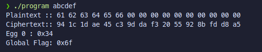

# VMwhere - Obfuscation Engine

## Introduction

### Objective:
The objective of this project is to devise a flexible obfuscation engine that allows developers to protect their IP by applying a variety of obfuscation and anti-reverse engineering techniques.

### Threat Model:
Attackers with access to compiled binary often employ a variety of tools to extract key pieces of information from the binary. Common tools include debuggers, disassemblers, decompilers, emulators etc.  We assume that the attacker has unrestricted access to the compiled binary (is able to execute it, disassemble it etc)  and does not have access to the source code.  

### Overview of Framework:
VMwhere is designed to provide protection against both forms of analysis - Static analysis and Dynamic analysis. It does so by implementing obfuscation techniques using the LLVM framework and by hooking into standard runtime functions like `__libc_start_main` and `main`.

## Architecture
VMwhere engine relies on the LLVM framework to implement its obfuscation techniques. Hence a brief discussion of the architecture is apt. 

LLVM (Low Level Virtual Machine) is a compiler infrastructure that operates on an intermediate representation (IR), a platform-independent, low-level language resembling an abstract RISC assembly. Because of its well-defined semantics and language independence, and rich API, LLVM IR is ideal for implementing program transformations like obfuscation.

VMwhere leverages LLVM's modular pass framework, which allows transformation passes to analyze or modify the IR. Each obfuscation technique in VMwhere—such as control flow flattening, constant encryption, or instruction substitution—is implemented as a custom LLVM pass. These passes are run sequentially on the IR, transforming it step-by-step before final code generation.


This architecture ensures that transformations happen at compile-time. Since we are operating on the IR, **no source code modifications are required**

A separate class of obfuscation techniques (anti-debug) are also implemented using wrappers around runtime functions like `__libc_start_main` and `main`. This is acheived using the `--wrap` compiler flag that allows us to specify a custom function to be called instead of the standard function. This obfuscation is performed at **binary link time**. This prevents attackers from dynamically debugging the binary.

The overall flow is then as follows:


## Overview of Implemented Obfuscation techniques
- String Obfuscation: LLVM pass designed to encrypt all strings at compile time using simple XOR arithmetic. The strings are only decrypted at runtime, hence preventing static analysis tools from being able to detect them.

- Instruction substitution: LLVM pass designed to replace all occurences of simple addition with a boolean expression that evaluates to addition. 

- Control flow flattening: LLVM pass designed to obfuscate control flow by routing execution flow using redundant switch-case statements.

- Anti-Disassembly: LLVM pass designed to insert specially crafted bytes that confuse disassemblers and decompilers. This prevents these tools from generating accurate assembly listing and higher level psuedo code (decompilation)

- Runtime Anti-Debug: 
  - Function wrapping: Using the `--wrap` compiler flag, we intercept calls to standard functions like `main` and `printf`. This allows us to insert anti-debugging logic and obfuscate syscalls.
  - Custom Syscall Obfuscation: Instead of making direct syscalls, we define custom syscalls with incorrect argument ordering and non-standard syscall numbers. This makes it difficult for debuggers to trace the program's execution.
  - Parent-Child Process with ptrace Monitoring: The parent process acts as a "syscall translator" using ptrace, while the child process runs the actual program logic but makes obfuscated syscalls. This adds an additional layer of complexity for reverse engineers.

## Obfuscation Logic

### String Obfuscation:
All strings are obfuscated by a simple xor function 
```cpp
std::vector<uint8_t> encryptString(StringRef str)
{
    std::vector<uint8_t> encrypted;
    for (char c : str)
    {
        encrypted.push_back(static_cast<uint8_t>(c) ^ encryptionKey);
    }
    encrypted.push_back(0 ^ encryptionKey); 
    return encrypted;
}
```

Using LLVM IR pass, all global strings are extracted and then encrypted. A new function definition is created for decrypting these strings and a call instruction to this function is created right before the string is used. This prevents static analysis tools from detecting these strings, making it harder to locate key functions.

The source code for this pass can be found in `obfuscate_strings.cpp`

It is worth mentioning that since the pass operates at an IR level, the strings in the source code remain unmodified.

### Instruction Substitution

A simple obfuscation pass that uses LLVM IR api to locate and replace all occurences of addition with an equivalent boolean operation. This makes it  harder to understand simple arithmetic logic.

`OBF_ADD = (A ^ B) + ((A & B) << 1)`

The source code for this pass can be found in `instruction_replace.cpp`

### Control Flow Flattening
Based on http://ac.inf.elte.hu/Vol_030_2009/003.pdf

This llvm based pass implements the control flow flattening algorithm. The basic idea is to encompass all the blocks as cases within a switch statement (or a switch like construct) and replicate the original control flow using a dispatch variable that controls which block will be executed next. This control variable can be modified at the end of each case to control the next case to be executed. 

I have also written a blog post on the algorithm and implementation over at https://21verses.blog/2025/01/10/post/

The source code for this can be found in `flatten.cpp`

### Anti-Disassembly
Based on https://medium.com/swlh/assembly-wrapping-a-new-technique-for-anti-disassembly-c144eb90e036

Special bytes are crafted and inserted into the binary. These bytes exploit a weakness in the recursive traversal algorithm employed by disassemblers to disassemble code. By encoding one x86 instruction within another, we can confuse the disassemblers into disassembling junk. Many variations of such bytes exist. VMwhere engine also randomizes each group of bytes slightly. This makes it harder for reverse engineers to patch the anti-disassembly bytes.

Since disassembly becomes impossible, it also becomes impossible to generate pseudo-c code (decompilation). This makes reverse engineering complex functions much more difficult.

The source code for this pass can be found in `anti-disassembly.cpp`

For an exact understanding of the implementation, please refer to the source code. Comments have been added to explain how LLVM API is being leveraged to implement the above stated obfuscation

### Function Wrapping Overview

The technique uses the compiler's function wrapping capability to intercept calls to standard functions. This is achieved with the `-Wl,--wrap=symbol` linker flag, where the original function `symbol` gets renamed to `__real_symbol`, and we provide an implementation for `__wrap_symbol` that gets called instead.

For example, we've wrapped two critical functions:
- `main`: The program's entry point
- `printf`: The standard output function

```c
// Example of function wrapping for main
int __wrap_main(int argc, char *argv[]) {
    // Our custom code before calling the real main
    extern int __real_main(int argc, char *argv[]);
    
    // Function body with anti-debugging logic
    // ...
    
    // Eventually call the real main function
    int result = __real_main(argc, argv);
    return result;
}
```

### Custom Syscall Obfuscation

Instead of making direct syscalls, the code defines custom syscalls with purposefully incorrect argument ordering and non-standard syscall numbers:

```c
#define SYS_CUSTOM_mmap 0x20000000
#define SYS_CUSTOM_mremap 0x20000001
#define SYS_CUSTOM_munmap 0x20000002
#define SYS_CUSTOM_mprotect 0x20000003

static long syscall_custom_mmap(unsigned long addr, unsigned long len, unsigned long prot, 
                                unsigned long flags, int fd, unsigned long offset) {
    long ret;
    register long rax __asm__("rax") = SYS_CUSTOM_mmap;
    register long rdi __asm__("rdi") = addr;
    register long rsi __asm__("rsi") = len;
    register long rdx __asm__("rdx") = flags;  // should be prot
    register long r10 __asm__("r10") = prot;   // should be flags
    register long r8 __asm__("r8") = fd;
    register long r9 __asm__("r9") = offset;

    __asm__ volatile(
        "syscall\n"
        : "=a"(ret)
        : "r"(rax), "r"(rdi), "r"(rsi), "r"(rdx), "r"(r10), "r"(r8), "r"(r9)
        : "rcx", "r11", "memory");
    return ret;
}
```

Note how these syscalls:
1. Use non-standard syscall numbers (0x20000000 range)
2. Intentionally swap or XOR arguments (like swapp/ versatile build system for building entire engine without docker (dependencies must be locally installed)ing `prot` and `flags` in mmap)
3. Would fail if called directly in the kernel

### Parent-Child Process with ptrace Monitoring
group of 
The `__wrap_main` function sets up a parent-child relationship where:

1. The parent process acts as a "syscall translator" using ptrace
2. The child process runs the actual program logic but makes obfuscated syscalls

```c
int __wrap_main(int argc, char *argv[]) {
    pid_t pid = fork();
    extern int __real_main(int argc, char *argv[]);

    if (pid == 0) {
        daddy = 0;
        tracee();  // Set up as tracee
        long ret = syscall_custom_mmap(0, 4096, PROT_READ | PROT_WRITE, 
                                      MAP_PRIVATE | MAP_ANONYMOUS, -1, 0);
        if (ret < 0)
            modify_args(argc, argv);
        int result = __real_main(argc, argv);
        return result;
    } else {
        daddy = 1;
        tracer(pid);  // Set up as tracer
        return 0;
    }
}
```

#### The Tracer Function

The parent process monitors all syscalls made by the child using ptrace:

```c
void tracer(pid_t child_pid) {
    // Wait for syscall entry
    // ...
    
    // For custom syscalls, correct the arguments and syscall number
    if (original_syscall == SYS_CUSTOM_mmap) {
        regs.orig_rax = SYS_mmap;
        
        // Swap prot and flags which were in the wrong registers
        unsigned long temp = regs.rdx;
        regs.rdx = regs.r10;
        regs.r10 = temp;
        
        // Update registers with corrected values
        ptrace(PTRACE_SETREGS, child_pid, 0, &regs);
    }/ versatile build system for building entire engine without docker (dependencies must be locally installed)
    // ... similar handling for other custom syscalls
}
```

### Anti-Debugging Mechanism

This technique makes the program difficult to debug for several reasons:

1. **Ptrace Exclusivity**: Only one process can ptrace a target. Since our parent is already tracing the child, external debuggers cannot attach:

```c
static int check_debugger() {
    if (ptrace(PTRACE_TRACEME, 0, 1, 0) == -1) {/ versatile build system for building entire engine without docker (dependencies must be locally installed)
        return 1;  // Debugger detected
    }
    ptrace(PTRACE_DETACH, 0, 1, 0);
    return 0;
}
```

2. **Syscall Obfuscation**: If a user bypasses the parent and runs the child directly in a debugger:
   - Custom syscalls will fail (kernel doesn't recognize 0x20000000 syscalls)
   - Arguments will be incorrect (swapped or XORed)

3. **Program Behavior Modification**: If syscalls fail (when debugged):
   - Command line arguments are modified through XOR operation
   - Output functions (printf) silently fail

#### Command-line Argument Modification

When a custom syscall fails (which happens when debugging), the program modifies its command-line arguments:

```c
void modify_args(int argc, char *argv[])
{
    // modify argv[1] by xoring
    if (argc > 1)
    {
        int n = strlen(argv[1]);
        for (int i = 0; i < n; i++)
        {
            argv[1][i] ^= 0xFF;  // Inverts all bits in each byte
        }
    }
}

int __wrap_main(int argc, char *argv[])
{
    // ...
    else if (pid == 0)
    {
        daddy = 0;
        tracee();
        long ret = syscall_custom_mmap(0, 4096, PROT_READ | PROT_WRITE, 
                                      MAP_PRIVATE | MAP_ANONYMOUS, -1, 0);
        if (ret < 0)
            modify_args(argc, argv);  // Modifies arguments if syscall fails
        int result = __real_main(argc, argv);
        return result;
    }
    // ...
}
```

This causes the program to silently receive completely different command-line arguments when being debugged, making its behavior unpredictable and difficult to trace.

#### Printf Suppression

Similarly, the `printf` wrapper will fail silently when being debugged:

```c
int __wrap_printf(const char *format, ...) {
    // Custom syscalls that will fail under debugger
    if (!daddy) {
        if (addr == 0) {
            ret = syscall_custom_mmap(/* ... */);
            addr = ret;
        } else {
            ret = syscall_custom_munmap(addr, 4096);
            addr = 0;
        }
        
        // Under debugger, syscall will fail and return early
        if (ret < 0) {
            return -1;  // No output
        }
    }
    
    // Normal printf behavior if syscalls succeed
    va_start(args, format);
    ret = vprintf(format, args);
    va_end(args);
    return ret;
}
```

### Stripping symbols
Finally the generated binaries is stripped using `llvm-strip`. This ensures symbols are no longer visible and attackers cannot figure reverse functions based on associated symbol name. It also reduces the size of the binary.

## Effect of obfuscation on given binary

Let us examine the effect of implementing each pass on the given AES source code to better understand what each obfuscation pass is doing (individually)

### String Obfuscation


### Instruction Substitution
Orignal


Obfuscated


### Control Flow Flattening
Original Control flow graph of main function/ versatile build system for building entire engine without docker (dependencies must be locally installed)


Obfuscated control flow graph of main function


### Anti-Disassembly
Main function disassembly


Anti-Disassembly obfuscation


### Runtime Anti-Debug

Normal Run<br>


Debugged Run


## Summary of Changes
In conclusion, VMwhere engine operates on the IR level at compile time and function wrapping at link time. Hence **no source code modifications** are required whatsoever. 

The obfuscation techniques implemented in VMwhere are both versatile and generic. They are not tailored to any specific source code (like given source code) and can be seamlessly applied—without requiring any modifications—to any C or C++ project. This design/ versatile build system for building entire engine without docker (dependencies must be locally installed) ensures broad applicability and makes VMwhere a powerful, plug-and-play obfuscation solution for protecting intellectual property across diverse codebases.

## Build

### Directory Structure:
```text
├── bench.sh
├── build.sh
├── compare.sh 
├── Dockerfile  
├── Makefile
├── src
│   ├── hooks
│   │   └── start_main_hook.c
│   ├── passes
│   │   ├── anti-disassembly.cpp
│   │   ├── flatten.cpp
│   │   ├── instruction_replace.cpp
│   │   └── obfuscate_strings.cpp
│   └── string_decrypt.c
└── test
    └── main.c
```

`bench.sh` is our bash script for benchmarking performance

`build.sh` is our bash script that runs out of the box to build docker image and build the binary inside the docker image. The easiest way to build the VMwhere engine is to run this `./build.sh`

`compare.sh` is our bash script to compare output of original and obfuscated binary

`Dockerfile` is the Dockerfile to install all dependencies and libraries used

`Makefile` is a versatile build system to build all obfuscation passes and obfuscated binary locally (Assumes that dependencies are installed)

`src` contains all the source code for the passes and hooks.

`test` contains given `main.c` source code

## Building a pass

**Below are commands used to build and implement LLVM pass. They are mentioned just for completeness sake. It is not required to execute these commands to build the engine**

To build an LLVM pass we use

`clang++ -fPIC -shared ./pass_name.cpp -o ./pass_name.so`

To statically compile a binary `main.c` with the pass applied we use

`clang -static -fpass-plugin=./pass_name.so main.c -o main`


## Building the engine and producing the obfuscated binary
The simplest way to build the engine is to ensure docker is running and use 
`./build.sh`

This will create the docker container, install the required dependencies, compile the passes and produce both original binary and obfuscated binary. 

**Both the binaries will be available locally in `./build` folder**

**Hence you only need to run `./build.sh` and then both original and obfuscated binary will be available to you in ./build folder to be used and tested**

### Building(dockerfile):

The provided Dockerfile uses a **multi-stage build** to efficiently compile and package the VMwhere project:

- **Base Image:**  
  The build starts from `debian:trixie` as the builder image, providing a stable Debian environment.

- **Environment Setup:**  
  `DEBIAN_FRONTEND=noninteractive` disables interactive prompts during package installation for automation.

- **Package Installation:**  
  Installs all necessary build tools and dependencies:
  - `clang`, `llvm`, `llvm-dev`: Required for compiling and linking LLVM-based passes and C/C++ code.
  - `build-essential`: Provides GCC, make, and other essential build utilities.
  - Cleans up package lists to reduce image size.

- **Source Copy:**  
  Sets the working directory to `/app` and copies the source code (`src`), test files (`test`), and the `Makefile` into the container.

- **Build Step:**  
  Runs `make build` to compile the project using the provided Makefile. This builds all passes, hooks, and the main binaries, placing the results in `/app/build`.

- **Export Stage:**  
  Switches to a minimal `alpine:latest` image for the final stage, ensuring a small and secure runtime environment.

- **Artifact Copy:**  
  Copies the compiled `/app/build` directory from the builder stage into `/build` in the final image. This ensures only the build artifacts are present, not the build tools or sources.

- **Entrypoint:**  
  Sets the entrypoint to `/bin/ash` (Alpine shell), allowing for interactive use or further scripting.

**Why multi-stage?**  
Multi-stage builds keep the final image minimal by separating the build environment (with compilers and dependencies) from the runtime environment (with only the compiled binaries). This reduces image size, attack surface, and ensures a clean deployment.

### Testing(benchmarking):

For testing, we use `hyperfine`. We use a custom benchmarking script that automates hyperfine-based measurements across 1,000 random inputs (lengths 1–16). For each input the script runs both the original and the obfuscated binaries, collects mean execution times (after three warmup runs), and finally computes overall average latencies and a slowdown factor.

**bench.sh** is made for this.

- Ensures `hyperfine` is installed via the system package manager (supports Debian/Ubuntu and Arch).  
- Generates `$NUM_TESTS` random alphanumeric inputs of length up to 16.  
- For each input, runs both `./build/original` and `./build/obfuscated` with three warmup and three measured runs, exporting JSON results.  
- Uses `jq` to extract mean runtimes, accumulates totals with `bc`, then computes the final average times and the slowdown factor.  
- Prints progress every 100 tests and displays a summary of average original vs. obfuscated runtimes and the slowdown multiplier.  

### Testing (comparison):

To ensure functional equivalence between the original and obfuscated binaries, we use a simple shell script `compare.sh` that:

**compare.sh** is made for this.

- Generates `NUM_TESTS` random alphanumeric inputs (length 1–16)
- Runs both `./build/original` and `./build/obfuscated` on each input
- Compares their outputs and reports any mismatch
- Prints a progress message every 100 successful tests


### Testing (results):

The tests were performed on `ROG Zephyrus G14 GA402NU` laptop with the following specs:
1. OS: `Debian GNU/Linux trixie/sid x86_64`
2. Kernel: `Linux 6.12.22-amd64`
3. CPU: `AMD Ryzen 7 7735HS`
4. RAM: `16 GB`


Following results were obtained:


The tests were performed also on 


Followign results were obtained:

